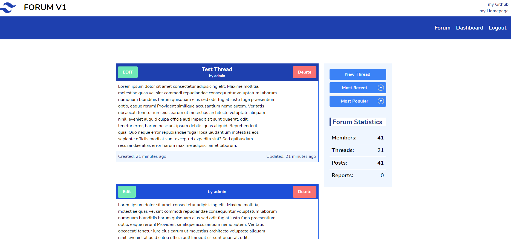
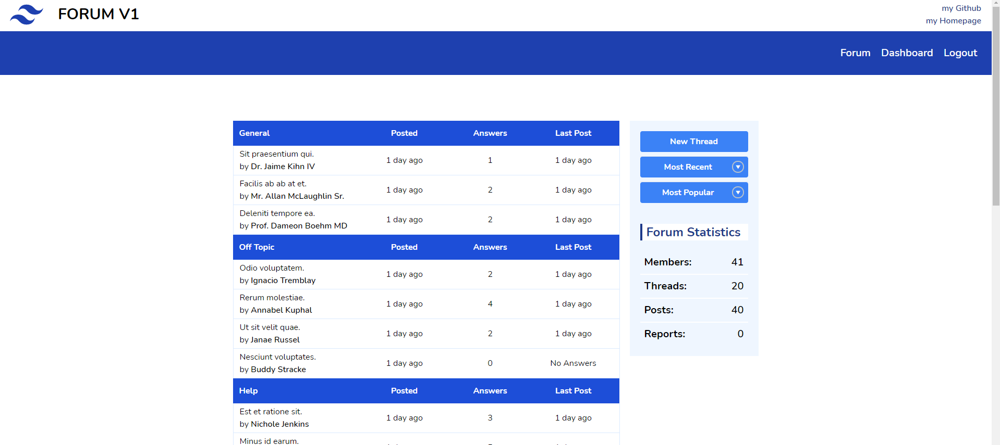
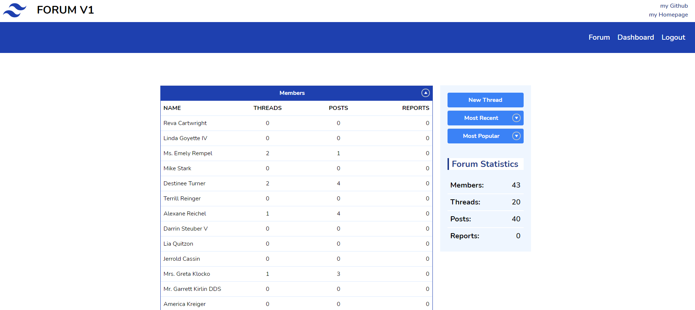
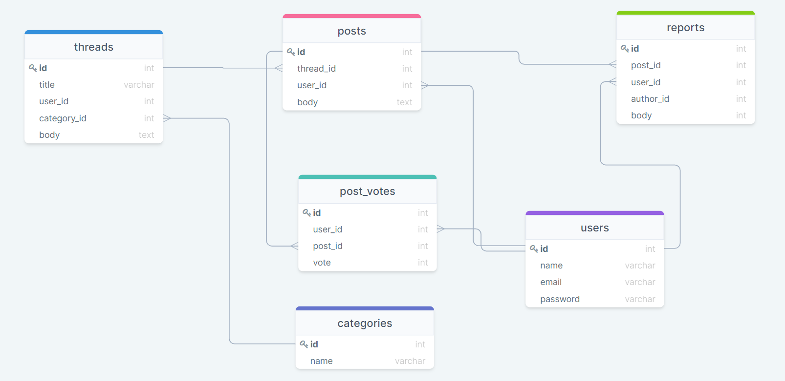

# Forum
A CRUD Application build with Laravel Breeze. The Frontend is made with Blade, TailwindCSS and Javascript.

---

## How to run the App
The App is live [here](https://myforumlaravel.herokuapp.com/). You can Login with an Account.

---
## Planned
1. User can send and receive Personal Messages
2. User Roles & Permissions
---
## User Stories
- User can create Account
- User can create Thread
    - User can Update own Threads
    - User can Delete own Threads
    
- User can Post in a Thread
    - User can Update own Posts
    - User can Delete own Posts

- User can report a Post
    - User can Delete Reported Post
    - User can Delete Report
---

## Pictures
### App

### Tables

